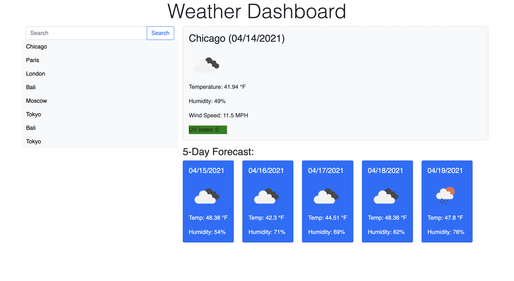

# Weather Dashboard

This weather dashboard allows users to search and view present and future weather conditions in the city of their choice. 

Data is pulled from the API and supplies the temperature, humidity, wind speed, UV index, and a 5-day forecast, all of which are displayed on the page. Previously searched cities are saved in local storage for ease of access in the future. 

## Contact

If you wish to contact me you can reach me at melanieuhrich13@gmail.com.

## Screenshot 

## Link to Deployed Application 

https://melanieuhrich.github.io/Weather-Dashboard/